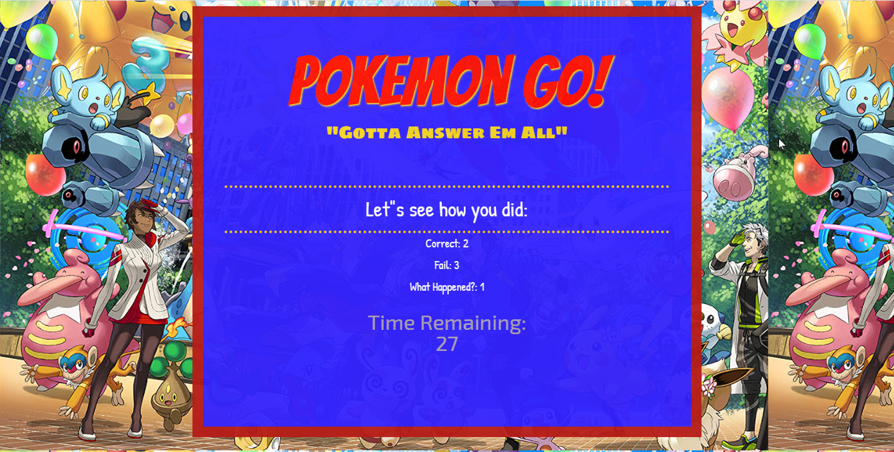

# TriviaGame

## User has set amount of time (30 seconds, displayed on screen) to answer a question by choosing from 4 answer choices
Upon completion or "time up", user is provided with a summary of results (correct, incorrect, unanswered)
_hopefully user enjoyed and retained some Pokemon facts because this app restarts automatically :) _

## practice & exposure to:
*While creating this app, utilized/focused on building skills in the following: *
- Pseudocoding
- JavaScript - logic
- jQuery ( HTML manipulation )
- _HTML elements_
- _CSS style_

## Technologies & Concepts applied:
- setTimeout
- setInterval
- clearTimeout
- clearInterval
- storing multiple methods(functions) as object properties
- tracking counters (correct/incorrectanswer/unanswered), and displaying only upon game end

- conditional statements
- comparing array indexes for boolean results

=================================================================
link to deployed project: https://kellikells.github.io/TriviaGame/

